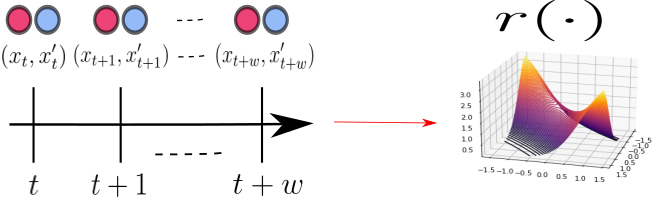

# OLRE Online Likelihood-Ratio Estimator. 
Quantifying the difference between two probability density functions, *p* and *q*, using available data, is a fundamental problem in Statistics and Machine Learning. A usual approach for addressing this problem is the density/likelihood-ratio estimation (LRE) between *p* and *q*, which—to our best knowledge—has been investigated mainly for the offline case. In this repository, we introduce a new framework for **online non-parametric LRE (OLRE)** for the setting where pairs of i.i.d. observations *(xₜ ∼ p, xₜ' ∼ q)* are observed over time. The non-parametric nature of our approach has the advantage of being agnostic to the forms of *p* and *q*. Moreover, we capitalize on the recent advances in **Kernel Methods** and functional minimization to develop an estimator that can be efficiently updated online.

<div align="center">
  
</div>

## Goal: 
This repository provides the necessary components to reproduce results similar to those described in the paper 'Online Non-parametric Likelihood Ratio-Estimation by Pearson Divergence Functional Minimization,' accepted at the 27th International Conference on Artificial Intelligence and Statistics (AISTATS).

## Requirements:
- `pandas` 1.2.5
- `numpy` 1.21.0
- `scipy` 1.7.0
- `matplotlib` 3.4.2
- `numba` 0.55.2

## Code Organization

1. **Experiments**: Contains the elements related to the reported experiment in the paper.
2. **Model**: Contains the algorithms described in the papers as well as auxiliary functions related to the simulation of different scenarios.
3. **Results**: The folder where the results can be stored.
4. **example.ipynb**: Jupyter notebook showing how to use the methods.
5. **run_experiments.py, generate_valuation_metrics.py, generate_plots.py**: These scripts generate the required elements to produce similar results to those reported in the paper.

## Remarks
- To see a concrete example of how OLRE works, please refer to the Jupyter notebook **example.ipynb**. The variables in the code have been named in a more intuitive way than in the paper. The following equivalences hold: *t₀* = warming_period and $\beta$ = smoothness. The constant *a* is fixed at its lower bound, i.e., *a = 4*.

## How to Generate the Results Reported in the Paper?

> ⚠️ **Note:** Running this process on a standard computer may take several days due to the large number of samples used for estimating the variance and mean.

### Steps:
1. **Set the results directory** where the output will be saved, e.g.:  
   `"C:/Users/.../Results"`

2. Given the **experiment** (`1, 2, 3`), the **method** (`OLRE, KLIEP, RULSIF`), the **regularization parameter** $\alpha$ (for **OLRE** and **RULSIF**), and the **smoothness parameter** (for **OLRE**), estimate the likelihood-ratio.  

   **Examples:**
   ```bash
   python run_experiments.py --results_directory "C:/Users/..../Results" --experiment 1 --T 10000 --n_runs 100 --alpha 0.1 --smoothness 1.0 --method "OLRE"
   python run_experiments.py --results_directory "C:/Users/..../Results" --experiment 1 --T 10000 --n_runs 100 --alpha 0.1 --method "RULSIF"
   python run_experiments.py --results_directory "C:/Users/..../Results" --experiment 1 --T 10000 --n_runs 100 --method "KLIEP"
   
3. **Compute the estimation errors** using the same parameters:
   
   **Examples:**
   ```bash
   python generate_valuation_metrics.py --results_directory "C:/Users/..../Results" --experiment 1 --T 10000 --n_runs 100 --alpha 0.1 --smoothness 1.0 --method "OLRE"
   python generate_valuation_metrics.py --results_directory "C:/Users/..../Results" --experiment 1 --T 10000 --n_runs 100 --alpha 0.1 --method "RULSIF"
   python generate_valuation_metrics.py--results_directory "C:/Users/..../Results" --experiment 1 --T 10000 --n_runs 100 --method "KLIEP"

4. **Run all parameter combinations** (method="OLRE",alpha=0.1,smoothness=1.0), (method="OLRE",alpha=0.1,smoothness=0.5),(method="OLRE",alpha=0.5,smoothness=1.0), (method="OLRE",alpha=0.5,smoothness=0.5)
   (method="RULSIF",alpha=0.1),(method="RULSIF",alpha=0.5),(method="KLIEP"), then generate the plot comparing the algorithm performances.
   ```bash
   python generate_plots.py --results_directory "C:/Users/alexd/Documents/OLRE/Results" --experiment 1

5. **Repeat the same steps** for each experiment (1,2,3).

## References 

If you  find this repository useful for your work, please cite the following publication: 

```bibtex
@InProceedings{pmlr-v238-concha-duarte24a,
  title = 	 {Online non-parametric likelihood-ratio estimation by {P}earson-divergence functional minimization},
  author =       {de la Concha Duarte, Alejandro D. and Vayatis, Nicolas and Kalogeratos, Argyris},
  booktitle = 	 {Proceedings of The 27th International Conference on Artificial Intelligence and Statistics},
  pages = 	 {1189--1197},
  year = 	 {2024},
  editor = 	 {Dasgupta, Sanjoy and Mandt, Stephan and Li, Yingzhen},
  volume = 	 {238},
  series = 	 {Proceedings of Machine Learning Research},
  month = 	 {02--04 May},
  publisher =    {PMLR},
  pdf = 	 {https://proceedings.mlr.press/v238/concha-duarte24a/concha-duarte24a.pdf},
  url = 	 {https://proceedings.mlr.press/v238/concha-duarte24a.html},
  abstract = 	 {Quantifying the difference between two probability density functions, $p$ and $q$, using available data, is a fundamental problem in Statistics and Machine Learning. A usual approach for addressing this problem is the likelihood-ratio estimation (LRE) between $p$ and $q$, which -to our best knowledge- has been investigated mainly for the offline case. This paper contributes by introducing a new framework for online non-parametric LRE (OLRE) for the setting where pairs of iid observations $(x_t \sim p, x’_t \sim q)$ are observed over time. The non-parametric nature of our approach has the advantage of being agnostic to the forms of $p$ and $q$. Moreover, we capitalize on the recent advances in Kernel Methods and functional minimization to develop an estimator that can be efficiently updated at every iteration. We provide theoretical guarantees for the performance of the OLRE method along with empirical validation in synthetic experiments.}
}


